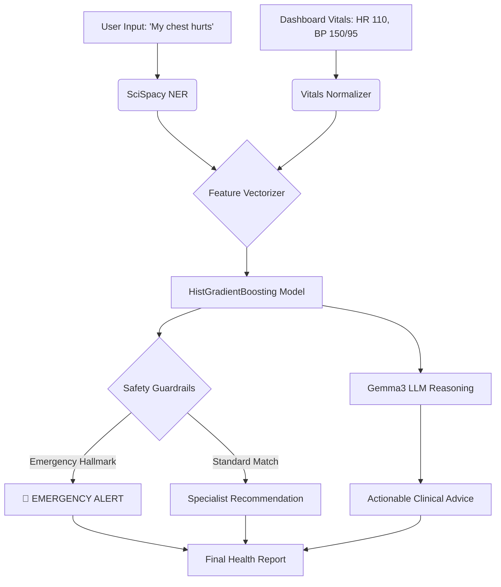

# 🧠 Famplus AI Intelligence Layer: Technical Architecture

## Overview
The Famplus AI module (the "Cerebellum") is a high-performance clinical decision support system. It leverages a multi-stage pipeline combining **Biomedical NLP**, **Gradient Boosted Machine Learning**, and **Local LLM Reasoning** to transform raw user symptoms and real-time vitals into actionable specialist recommendations.

---

## 🏗️ The 4-Layer Intelligence Pipeline

### 1. NLP Gateway (Biomedical Entity Recognition)
Traditional keyword matching fails in clinical contexts (e.g., "pounding head" vs "headache"). Famplus uses **SciSpacy (`en_core_sci_sm`)**, a specialized NLP model for biomedical text.

- **NER (Named Entity Recognition)**: Extracts medical entities directly from natural language.
- **Alias Expansion**: A curated dictionary maps conversational slang (e.g., "heart racing") to canonical clinical features (`palpitations`).
- **Fuzzy Vectorization**: Extracted entities are mapped to the ML model's 130+ feature columns using a high-precision token-set fuzzy matching algorithm.

### 2. Context Engine (Vitals-Aware Intelligence)
Unlike static diagnostic tools, Famplus is **Vitals-Aware**. It ingests the patient's dashboard data:
- **Numerical Features**: Age, Heart Rate (bpm), Systolic BP, Diastolic BP.
- **Normalization**: Vitals are processed through a `StandardScaler` (Z-score normalization) to ensure they hold equal weight with binary symptom features during inference.

### 3. Inference Core (HistGradientBoosting)
The engine utilizes a **Histogram-based Gradient Boosted Decision Tree (HGBDT)** classifier.
- **Why HGBDT?**: It handles mixed feature types (binary + numerical) natively and offers superior non-linear relationship mapping compared to Naive Bayes or Random Forest.
- **Inference Logic**:
  - The model computes raw probability distributions across 41+ disease classes.
  - **Clinical Weighting**: High-severity conditions (e.g., Heart Attack) are penalized by default to prevent false positives unless specific **Hallmark Symptoms** are detected.

### 4. Reasoning Layer (Local Gemma3 LLM)
For deep contextual advice, the engine integrates with a local **Gemma3 (4B/8B)** model via Ollama.
- **Grounding**: The LLM is provided with the ML model's prediction and the patient's vitals as "ground truth".
- **Output**: Generates human-readable clinical guidance, precautions, and specialist justification.

---

## 🔒 Safety & "Guardian" Protocols

### The "General Physician First" Philosophy
Famplus is designed to be a **Triage tool**, not a diagnostic replacement. 
- **Conservative Gating**: If the AI's confidence is below 80% for a severe condition, it defaults the recommendation to a **General Physician**.
- **Emergency Hallmarks**: Certain symptoms (e.g., `crushing_chest_pain`, `facial_paralysis`) act as "Bypass Keys" that immediately trigger high-urgency alerts regardless of the ML model's probabilistic output.

### Urgency Scoring
Urgency is calculated via a composite score:
`Urgency = (Symptom Severity Sum) + (Vitals Anomaly Delta) + (Model Confidence)`

---

## 📊 Data Flow Diagram

---

## 🛠️ Technical Stack
- **Framework**: FastAPI (Python 3.10+)
- **NLP**: Spacy / SciSpacy
- **ML**: Scikit-Learn (HistGradientBoosting), Joblib
- **LLM**: Ollama (Gemma3)
- **Data**: Pandas / NumPy

---

> [!IMPORTANT]
> **Clinical Disclaimer**: This module is for informational support only. It is engineered to assist in specialist discovery and should never be used as a definitive medical diagnosis. Always consult a qualified healthcare professional.
