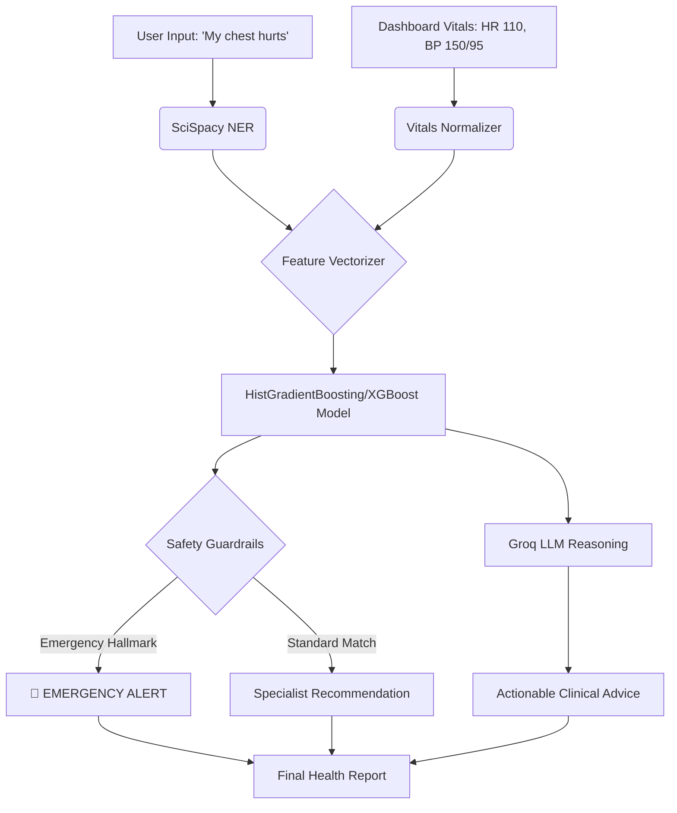

# 🧠 Famplus AI Intelligence Layer: Technical Architecture

## Overview
The Famplus AI module (the "Cerebellum") is a comprehensive health support prototype. It leverages a multi-stage pipeline combining **Biomedical NLP**, **Gradient Boosted Machine Learning / Classical ML**, and **Cloud LLM Reasoning via Groq** to demonstrate how user symptoms and real-time vitals can be transformed into actionable health insights.

---

## 🏗️ The 4-Layer Intelligence Pipeline

### 1. NLP Gateway (Biomedical Entity Recognition)
Traditional keyword matching fails in clinical contexts (e.g., "pounding head" vs "headache"). Famplus uses **SciSpacy (`en_core_sci_sm`)**, a specialized NLP model for biomedical text.

- **NER (Named Entity Recognition)**: Extracts medical entities directly from natural language.
- **Alias Expansion**: Maps conversational slang (e.g., "heart racing") to canonical clinical features (`palpitations`).
- **Fuzzy Vectorization**: Extracted entities are mapped to the ML model's 130+ feature columns using a high-precision token-set fuzzy matching algorithm.

### 2. Context Engine (Vitals-Aware Intelligence)
Unlike static diagnostic tools, Famplus is **Vitals-Aware**. It ingests the patient's dashboard data:
- **Numerical Features**: Age, Heart Rate (bpm), Systolic BP, Diastolic BP.
- **Normalization**: Vitals are processed through a `StandardScaler` (Z-score normalization) to ensure they hold equal weight with binary symptom features during inference.

### 3. Inference Core (HistGradientBoosting / XGBoost)
The engine utilizes a **Histogram-based Gradient Boosted Decision Tree (HGBDT) or XGBoost** classifier, falling back to Naive Bayes if v1 assets are loaded.
- **Mixed Feature Vectorization**: Handles binary symptom columns and normalized/scaled numerical vitals columns natively.
- **Inference Logic**:
  - The model computes raw probability distributions across 41+ disease classes.
  - **Clinical Weighting**: High-severity conditions (e.g., Heart Attack, Paralysis, AIDS) are penalized by default to prevent false positives unless specific **Hallmark Symptoms** are detected.

### 4. Reasoning Layer (Cloud LLM via Groq)
For deep contextual advice and medical summaries, the engine integrates with **Groq Cloud API** using the `llama-3.1-8b-instant` model.
- **Grounding**: The LLM is provided with the ML model's prediction and the patient's vitals as "ground truth".
- **Safety Overrides**: If Groq is unavailable or returns an error, the local ML predictions are used as a fallback.
- **Output**: Generates human-readable clinical guidance, precautions, and specialist justification.

---

## 🔒 Safety & "Guardian" Protocols

### The "General Physician First" Philosophy
Famplus is designed to be a **Triage tool**, not a diagnostic replacement. 
- **Conservative Gating**: If the AI's confidence is below 80% for a severe condition, it defaults the recommendation to a **General Physician**.
- **Emergency Hallmarks**: Certain symptoms (e.g., `crushing_chest_pain`, `facial_paralysis`) act as "Bypass Keys" that immediately trigger high-urgency alerts regardless of the ML model's probabilistic output.

### Urgency Scoring
Urgency is calculated via a composite score:
`Urgency = (Symptom Severity Sum) + (Vitals Anomaly Delta) + (Model Confidence)`

---

## 📊 Data Flow Diagram


```mermaid
graph TD
    A[User Input: 'My chest hurts'] --> B(SciSpacy NER)
    V[Dashboard Vitals: HR 110, BP 150/95] --> C(Vitals Normalizer)
    B --> D{Feature Vectorizer}
    C --> D
    D --> E[HistGradientBoosting/XGBoost Model]
    E --> F{Safety Guardrails}
    F -->|Emergency Hallmark| G[🚨 EMERGENCY ALERT]
    F -->|Standard Match| H[Specialist Recommendation]
    E --> I[Groq LLM Reasoning]
    I --> J[Actionable Clinical Advice]
    G --> K[Final Health Report]
    H --> K
    J --> K
```

---

## 🌐 Endpoints & API Gateway
The FastAPI application exposes the following endpoints:

| Endpoint | Method | Description |
|----------|--------|-------------|
| `/health` | `GET` | Lightweight health check. Verifies if models and metadata are loaded. Used for uptime monitoring and keep-awake pings. |
| `/` | `GET` | Root path. Returns service metadata and API version. |
| `/predict_symptoms` | `POST` | Primary inference endpoint. Accepts symptoms text and vitals context, and returns a detailed `SymptomResponse`. |
| `/predict_wellness` | `POST` | Evaluates vitals history and latest dashboard measurements to generate a composite Wellness Score (0-100). |

---

## ⚡ Keep-Awake & Uptime Integration
Since the AI engine is hosted on a Render Free Instance, it will spin down after 15 minutes of inactivity. To prevent cold starts:
- A GitHub Actions workflow (`keep-awake.yml`) runs on a cron schedule every **12 minutes**.
- The workflow pings the `/health` endpoint of both the main backend and the AI service.
- If a service is down or sleeping, the ping wakes it up before user requests hit.

---

## 🛠️ Technical Stack & Requirements
- **Framework**: FastAPI (Python 3.10+)
- **NLP**: Spacy / SciSpacy (`en_core_sci_sm`)
- **ML**: Scikit-Learn (HistGradientBoosting), Joblib
- **LLM API**: Groq SDK (`llama-3.1-8b-instant`)
- **Data**: Pandas / NumPy

### Configuration Note:
To run the reasoning layer, ensure `GROQ_API_KEY` is configured in the environment variables:
```bash
export GROQ_API_KEY="your-groq-api-key"
```

And for the NLP pipeline:
```bash
pip install https://s3-us-west-2.amazonaws.com/ai2-s2-scispacy/releases/v0.5.4/en_core_sci_sm-0.5.4.tar.gz
```

---

> [!IMPORTANT]
> **Clinical Disclaimer**: This module is for informational support only. It is engineered to assist in specialist discovery and should never be used as a definitive medical diagnosis. Always consult a qualified healthcare professional.

